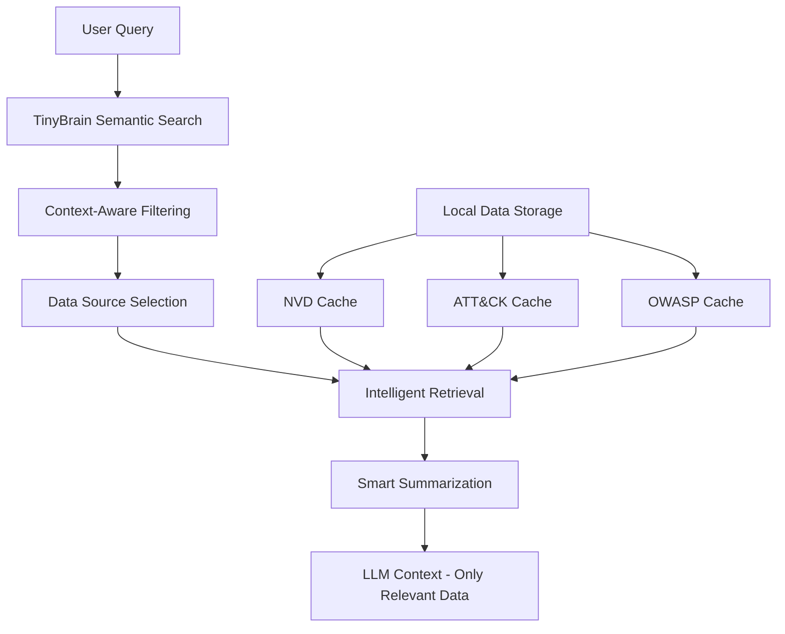

# TinyBrain Security Knowledge Hub

## 🎯 **Overview**

The TinyBrain Security Knowledge Hub is an intelligent data integration system that provides LLMs with access to authoritative security databases while maintaining optimal context window efficiency. Instead of overwhelming LLMs with massive datasets, it uses smart retrieval and summarization to provide only the most relevant, targeted information.

## 📊 **Data Sources & Sizes**

### **National Vulnerability Database (NVD)**
- **Source**: https://services.nvd.nist.gov/rest/json/cves/2.0
- **Total Records**: 314,835 CVE entries (as of October 2024)
- **Data Format**: JSON API with pagination
- **Estimated Size**: ~50-100MB uncompressed
- **Update Frequency**: Real-time via API
- **Key Fields**: CVE ID, description, CVSS scores, references, affected products

### **MITRE ATT&CK Framework**
- **Source**: https://raw.githubusercontent.com/mitre/cti/master/enterprise-attack/enterprise-attack.json
- **Data Format**: STIX 2.1 JSON bundle
- **File Size**: ~38MB (39,787,657 bytes)
- **Content**: 600+ techniques, 14 tactics, 200+ groups, 100+ software
- **Update Frequency**: Regular updates via GitHub
- **Key Fields**: Technique ID, name, description, tactics, procedures

### **OWASP Testing Guide**
- **Source**: OWASP Testing Guide v4 (to be researched)
- **Estimated Size**: ~5-10MB structured data
- **Content**: Testing methodologies, checklists, procedures
- **Update Frequency**: Periodic releases
- **Key Fields**: Test categories, procedures, examples

## 🏗️ **Architecture**

### **Smart Retrieval Pipeline**



### **Key Components**

1. **Data Downloader**: Automated download and update system
2. **Local Storage**: SQLite-based caching with full-text search
3. **Semantic Search**: Embedding-based similarity matching
4. **Smart Summarizer**: Context-aware data reduction
5. **MCP Tools**: New tools for intelligent querying

## 🛠️ **Implementation Plan**

### **Phase 1: Data Infrastructure**
- [x] Research data sources and APIs
- [ ] Implement data download system
- [ ] Create local storage schema
- [ ] Build update mechanisms

### **Phase 2: Smart Retrieval**
- [ ] Implement semantic search for security data
- [ ] Build context-aware filtering
- [ ] Create summarization engine
- [ ] Add relationship mapping

### **Phase 3: MCP Integration**
- [ ] Design new MCP tools
- [ ] Implement query_nvd tool
- [ ] Implement query_attack tool
- [ ] Implement query_owasp tool

### **Phase 4: Optimization**
- [ ] Performance tuning
- [ ] Context window optimization
- [ ] Caching strategies
- [ ] Error handling

## 🎯 **Context Window Strategy**

### **Problem**: Large datasets overwhelm LLM context windows
### **Solution**: Intelligent retrieval and summarization

**Before (Generic Approach):**
```
LLM: "SQL injection is bad, use parameterized queries"
```

**After (TinyBrain + Security Hub):**
```
TinyBrain: "Found 3 relevant CVEs: CVE-2024-1234 (CVSS 9.8), CVE-2023-5678 (CVSS 8.1)
Maps to ATT&CK T1055.001 (Process Injection)
OWASP Testing Guide Section 5.3.4 provides specific test cases
Summary: Critical SQL injection affecting [specific component] with [specific impact]"
```

### **Context Efficiency Gains**
- **Targeted Information**: Only relevant data sent to LLM
- **Authoritative Sources**: Real CVE data, not generic advice
- **Specific Guidance**: Exact techniques and procedures
- **Reduced Hallucination**: Based on real security data

## 🔧 **New MCP Tools**

### **query_nvd**
```json
{
  "name": "query_nvd",
  "description": "Query NVD for relevant CVEs based on vulnerability context",
  "parameters": {
    "cwe_id": "CWE identifier (e.g., CWE-89)",
    "component": "Affected component or technology",
    "severity": "Minimum CVSS score threshold",
    "limit": "Maximum number of results (default: 10)"
  }
}
```

### **query_attack**
```json
{
  "name": "query_attack",
  "description": "Query MITRE ATT&CK for relevant techniques and procedures",
  "parameters": {
    "technique_id": "ATT&CK technique ID (e.g., T1055.001)",
    "tactic": "ATT&CK tactic (e.g., persistence)",
    "platform": "Target platform (e.g., windows, linux)",
    "limit": "Maximum number of results (default: 10)"
  }
}
```

### **query_owasp**
```json
{
  "name": "query_owasp",
  "description": "Query OWASP Testing Guide for relevant procedures",
  "parameters": {
    "category": "Testing category (e.g., authentication)",
    "vulnerability_type": "Type of vulnerability",
    "testing_phase": "Testing phase (e.g., static, dynamic)",
    "limit": "Maximum number of results (default: 10)"
  }
}
```

## 📈 **Expected Benefits**

### **For Security Professionals**
- **Accurate Information**: Real CVE data and current techniques
- **Comprehensive Coverage**: Multiple authoritative sources
- **Efficient Workflow**: Targeted information without data overload
- **Up-to-date Intelligence**: Regular updates from official sources

### **For LLM Interactions**
- **Reduced Hallucination**: Based on real security data
- **Specific Guidance**: Exact procedures and techniques
- **Context Efficiency**: Only relevant information in context window
- **Authoritative Responses**: Backed by official security databases

### **For TinyBrain**
- **Enhanced Value**: Becomes the definitive security knowledge hub
- **Competitive Advantage**: Unique integration of multiple security sources
- **Scalability**: Efficient handling of large datasets
- **Maintainability**: Automated updates and local caching

## 🚀 **Next Steps**

1. **Implement Data Download System**
2. **Create Local Storage Schema**
3. **Build Smart Retrieval Pipeline**
4. **Add New MCP Tools**
5. **Test with Real Security Scenarios**
6. **Optimize for Context Window Efficiency**

## 📚 **References**

- [NVD API Documentation](https://nvd.nist.gov/developers/vulnerabilities)
- [MITRE ATT&CK Framework](https://attack.mitre.org/)
- [OWASP Testing Guide](https://owasp.org/www-project-web-security-testing-guide/)
- [STIX 2.1 Specification](https://docs.oasis-open.org/cti/stix/v2.1/stix-v2.1.html)

---

*This document will be updated as implementation progresses.*
